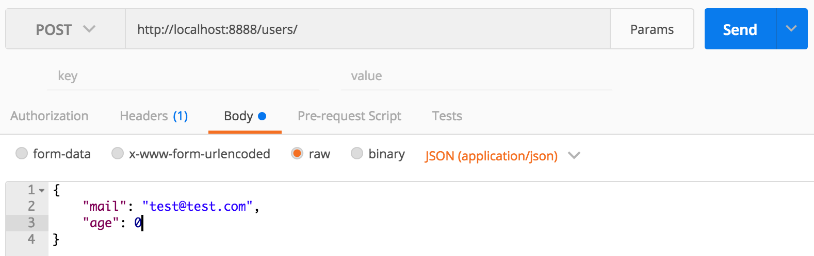

----------------------

# Mini API php & sqlite3
Ce workshop couvre les compétences suivantes de la certification Développeur.

1. [x] Requêtes SQL
    
2. [x] Création d'une Base de Données

---------------------------

Cette api n'a pas besoin de l'installation de WAMP, lAMP ou MAMP

On va simplement utiliser le petit module server de php. Il faut run la commande suivant dans votre dossier

```
php -S localhost:8888 index.php
```

Vous pouvez l'utiliser pour GET, PUT, POST et DELETE via les routes suivantes:

```
localhost:8888/{table}/{id}
```

Elle est inspirée de cette [API](https://www.leaseweb.com/labs/2015/10/creating-a-simple-rest-api-in-php/).

Pour la tester on peut utiliser Postman. Il faut juste faire attention de bien set le body sur _raw_ avec un type _application/json_.



On utilise SQLite3 à la place de MySQL qui créera un fichier database.db à la première execution, avec les différentes tables qu'on lui aura demandé de créer.

```
$pdo->query("CREATE TABLE IF NOT EXISTS users ( 
    id           INTEGER         PRIMARY KEY AUTOINCREMENT,
    mail         VARCHAR( 250 ),
    age          INTEGER
);");
```

On utilisera aussi la class PDO qui permet de faire de préparer ses requètes et apporte un layer de sécurité à sa base de données. Mais ce projet tel quel n'apporte pas la sécurité nécessaire à une API.

Son but est de faire ses premiers pas en PHP et SQL.

Différentes ressources :
+ [Comprendre les regexp](http://rubular.com/r/UfIbUhPuP1) et la méthode `preg_replace()`.
+ Un [guide](http://stackoverflow.com/questions/18050071/php-parse-syntax-errors-and-how-to-solve-them) d'erreur de parsing sur stackoverflow.
+ [SQLite tutorials](https://www.tutorialspoint.com/sqlite/sqlite_constraints.htm)
+ [SQL constraints](https://www.techonthenet.com/sqlite/unique.php)
+ [SQL datatypes](https://www.sqlite.org/datatype3.html)
+ [SQL foreign keys](https://www.w3schools.com/sql/sql_foreignkey.asp)
+ SQL cheat sheet
    
+ SQL joins
    